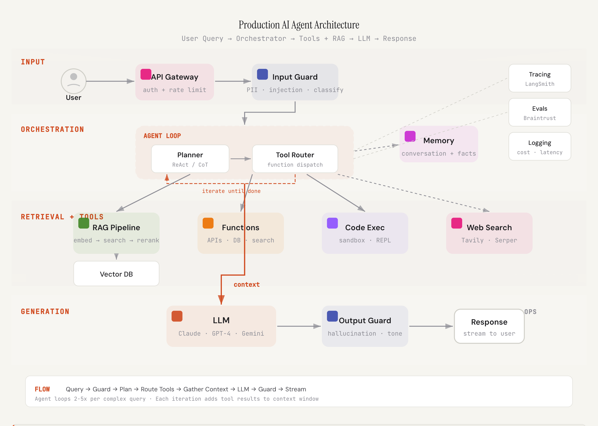
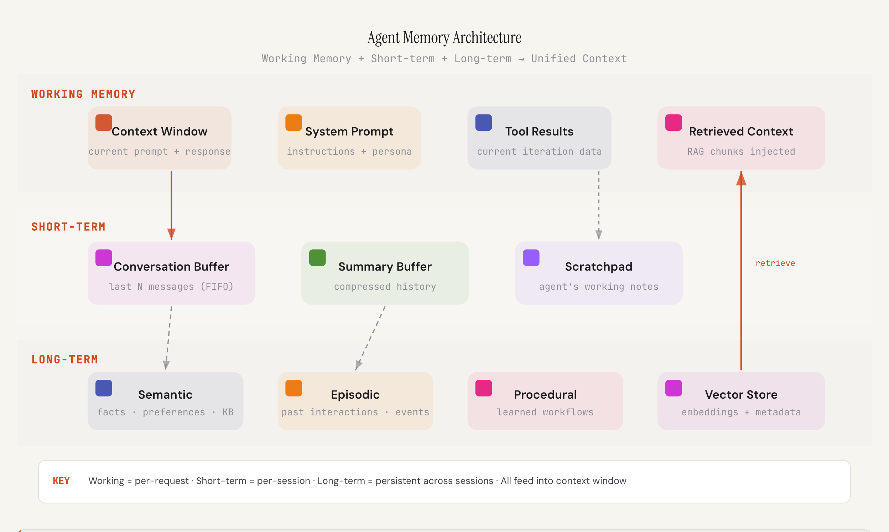
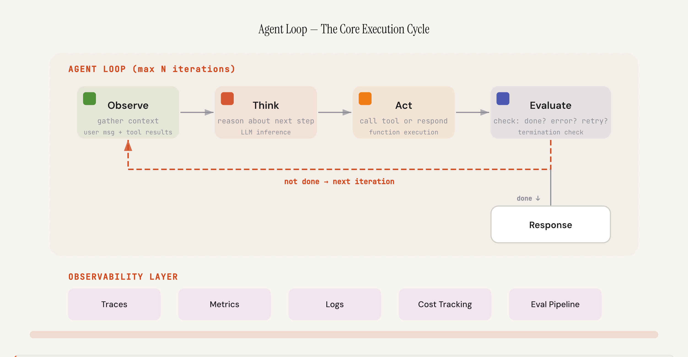
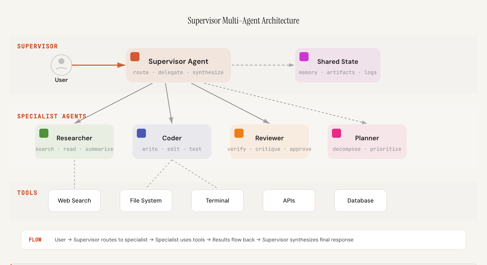
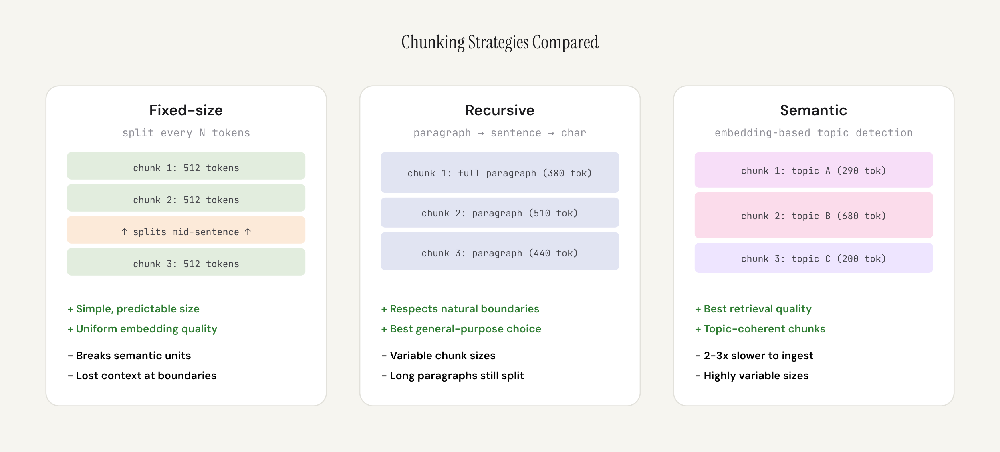
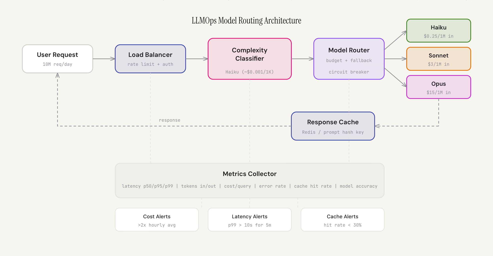
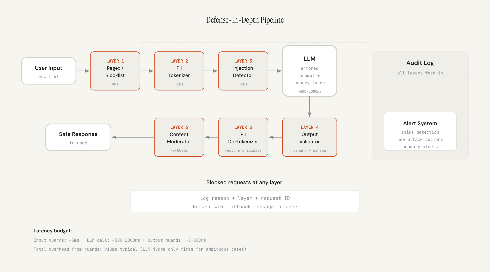
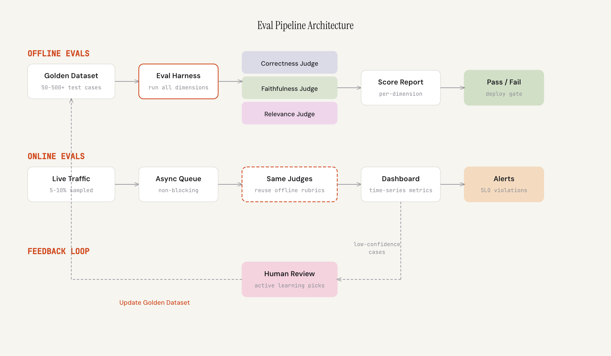
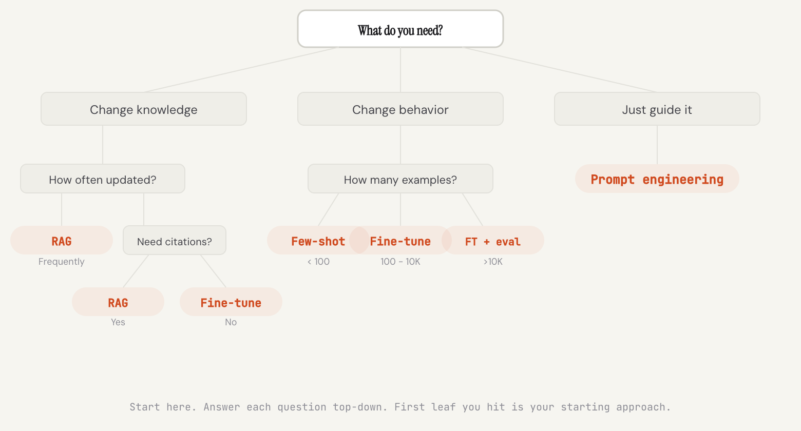

# Agentic Engineering

**Decision frameworks and architectural patterns for staff, principal, and CTO-level system design interviews.**

Built by Mahesh Guntumadugu — battle-tested design and architectural patterns that signal staff, principal, and CTO-level thinking.

> Not theory. Not slides. Interactive decision trees with the exact reasoning chains that signal senior+ thinking.

---

## What's Inside

### System Design Frameworks (14)

Each framework is a **decision tree** — the structured thinking process that interviewers look for at staff+ level.

| # | Framework | Key Decisions |
|---|-----------|--------------|
| 01 | **Database Selection** | Scale → Access pattern → Joins → Consistency → Writes → Profiles |
| 02 | **Rate Limiter Design** | Token bucket vs sliding window vs leaky bucket, distributed coordination |
| 03 | **Caching Strategies** | Cache-aside vs write-through, invalidation, thundering herd |
| 04 | **Message Queues** | At-least-once vs exactly-once, ordering, dead letter queues |
| 05 | **Scaling Patterns** | Vertical vs horizontal, sharding strategies, read replicas |
| 06 | **Event-Driven Architecture** | Event sourcing, CQRS, saga patterns, idempotency |
| 07 | **State Machines** | Workflow orchestration, distributed state, compensation |
| 08 | **API Design** | REST vs GraphQL vs gRPC, versioning, pagination, rate limiting |
| 09 | **Resilience Patterns** | Circuit breakers, bulkheads, retries with backoff, chaos engineering |
| 10 | **Observability** | Metrics vs logs vs traces, SLOs, alerting strategies |
| 11 | **Auth Architecture** | OAuth2, JWT, session management, RBAC vs ABAC |
| 12 | **Deployment Strategies** | Blue-green, canary, feature flags, rollback patterns |
| 13 | **Concurrency** | Locks, optimistic concurrency, actor model, async patterns |
| 14 | **Distributed Systems** | CAP theorem, consensus, vector clocks, CRDTs |

---

## AI Engineering Playbook

Production architecture patterns for building AI agents, RAG pipelines, and LLM systems.

### 01 — AI Agent System Design

ReAct loops, tool dispatch, RAG pipelines, evaluation harnesses — the full architecture of a production AI agent.

<p align="center">
  
</p>

---

### 02 — Agent Memory Architecture

Procedural, semantic, and episodic memory — how agents remember across turns, sessions, and users. The consolidation gate that distills episodes into lasting facts.

<p align="center">
  
</p>

---

### 03 — Agent Harness & Loop Engineering

The orchestration loop: Observe → Think → Act → Evaluate. With termination gates, convergence detection, cost caps, and the tracing layer that makes agents observable.

<p align="center">
  
</p>

---

### 04 — Multi-Agent Systems

The evolution from single agent to swarm — teams vs swarms, supervisor patterns, and when each level is appropriate.

<p align="center">
  
</p>

---

### 05 — RAG Pipeline Deep Dive

End-to-end retrieval augmented generation — chunking, embeddings, hybrid search, RRF scoring, reranking, and the eval metrics that catch silent quality degradation.

<p align="center">
  
</p>

---

### 06 — LLMOps — Production LLM Infrastructure

Model serving, cost routing (Haiku→Sonnet→Opus), token budgeting, latency SLOs — the infrastructure that turns an LLM prototype into a system that handles 10M requests/day.

<p align="center">
  
</p>

---

### 07 — AI Guardrails & Safety

Prompt injection defense (direct/indirect/tool-result), PII tokenization, output validation, content moderation — the security layer that separates a demo from production.

<p align="center">
  
</p>

---

### 08 — Evaluation Engineering

LLM-as-judge with rubrics, golden datasets, regression testing, human-in-the-loop — how to know if your AI system actually works, and catch when it silently breaks.

<p align="center">
  
</p>

---

### 09 — Fine-tuning vs Prompting vs RAG

The decision framework every AI architect needs — when to prompt engineer, when to retrieve, when to fine-tune, and when to combine them.

<p align="center">
  
</p>

---

## Tech Stack

- **React 19** — latest React with automatic batching
- **Vite** — sub-second HMR, optimized builds
- **React Router v7** — client-side routing with page transitions
- **CSS Custom Properties** — full design system with fluid typography via `clamp()`
- **Zero dependencies** — no UI library, no CSS framework, no syntax highlighter
- **Responsive** — mobile (375px) → tablet (768px) → desktop (1400px+)
- **Dark/Light theme** — system preference detection + manual toggle
- **Cloudflare Pages** — global CDN, auto-deploy from GitHub

## Design Highlights

- **Page transitions** — fade/slide animation on route changes
- **Tab crossfade** — smooth content transitions when switching tabs
- **Staggered animations** — Decision cards animate in with nth-child delays
- **Fluid typography** — titles scale from 28px to 44px via `clamp()`
- **Animated hover states** — cards lift, underlines slide, arrows shift
- **`prefers-reduced-motion`** — all animations respect user preference

---

## Run Locally

```bash
git clone https://github.com/gmaheshraju/Hands-on-AgenticAI.git
cd Hands-on-AgenticAI
npm install
npm run dev
```

Open [http://localhost:5173](http://localhost:5173)

## Deploy

Connected to **Cloudflare Pages** with auto-deploy:

- Build command: `npm run build`
- Output directory: `dist`
- SPA routing handled natively by Cloudflare Pages

---

## License

MIT

---

**Built by Mahesh Guntumadugu**
