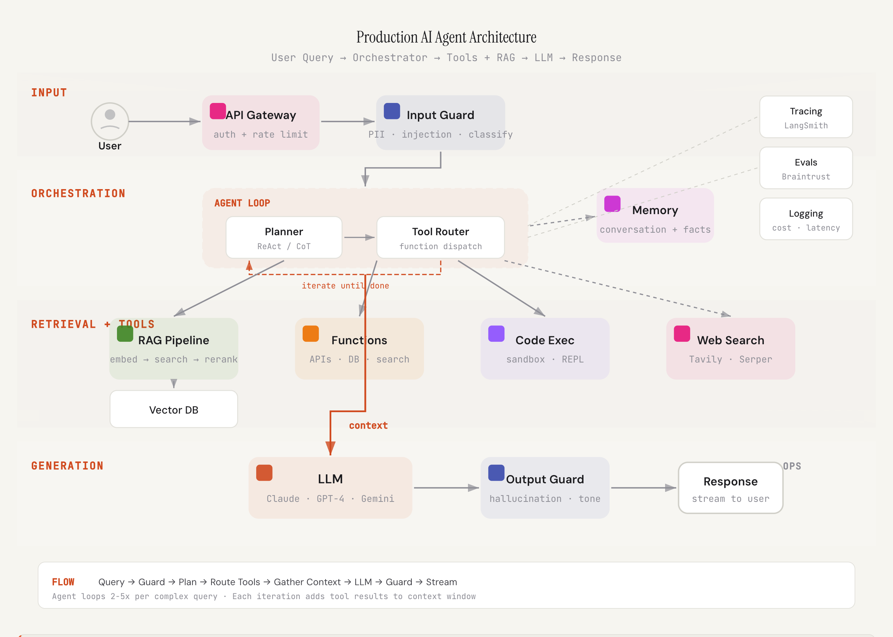
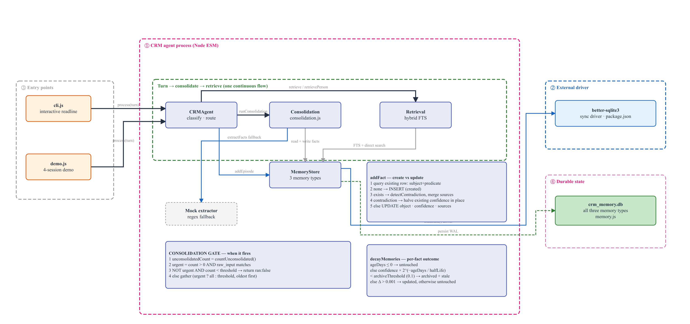
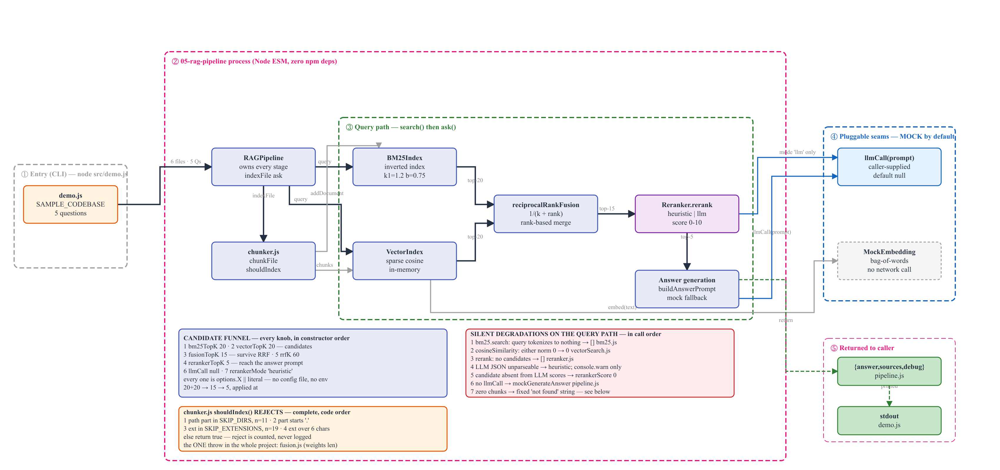
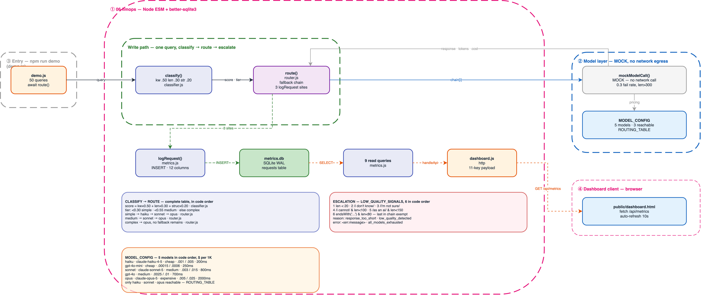
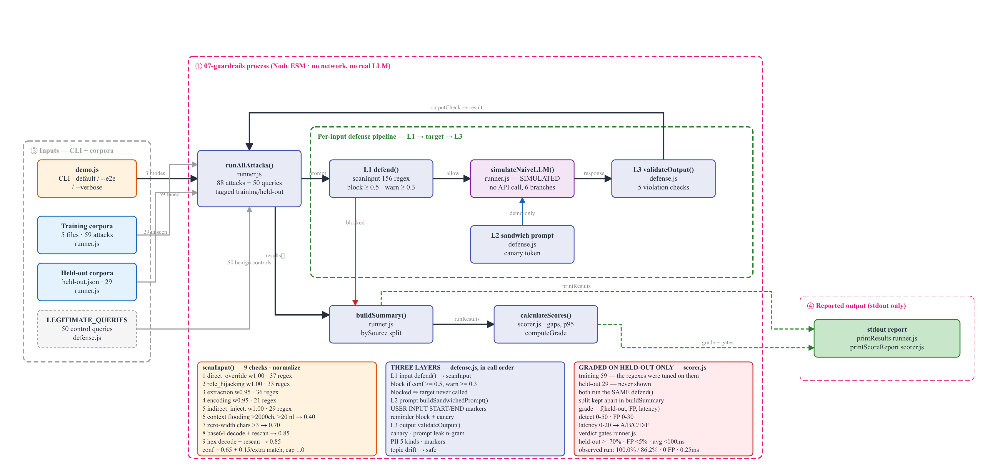
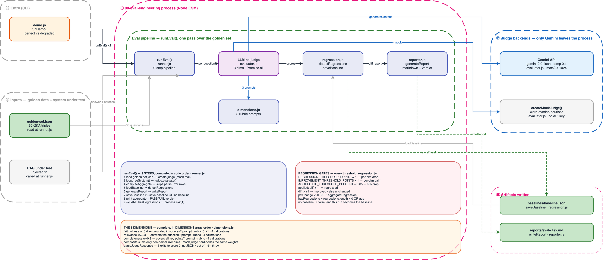
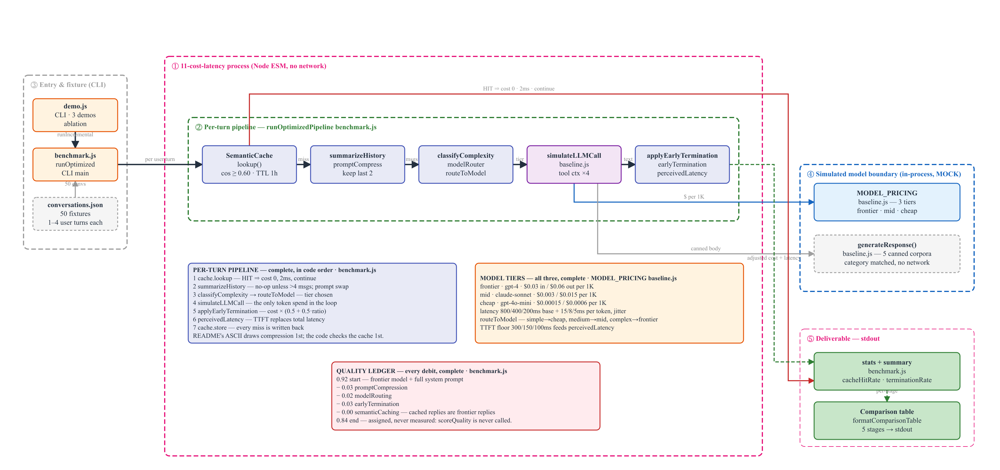

# Hands-On Agentic AI Engineering — 31 Production-Grade Projects Built From Scratch

**Author:** [Mahesh Guntumadugu](https://github.com/gmaheshraju) · **Live site:** [curiousengineers.in](https://curiousengineers.in) · **Topics:** AI Agents · Agentic AI · LLM Engineering · RAG · LLMOps · AI Observability · Multi-Agent Systems

> A portfolio of **31 hands-on, production-grade AI engineering projects** — real agents, real RAG pipelines, real LLM infrastructure — each built **from scratch in Node.js/Python with minimal frameworks**, tested, and hardened. Not slideware. Not notebook demos. Runnable systems that show *how* production agentic AI is actually engineered, from the ReAct loop up to observability, cost attribution, guardrails, and self-improvement.

<p align="center">
  
</p>

---

## For recruiters & hiring managers

**What this repository demonstrates** — end-to-end ownership of the modern **Generative AI / LLM / AI-agent stack**, at the depth expected of a **Staff / Principal / Lead AI Engineer or AI Architect**:

- **AI agents & orchestration** — ReAct loops, tool use, multi-agent coordination, durable long-running execution, self-improvement
- **RAG & retrieval** — hybrid search (BM25 + embeddings), reranking, chunking, eval-driven quality gates
- **LLMOps & infrastructure** — model routing, LLM gateways, cost/latency optimization, semantic caching, cost attribution
- **AI safety & governance** — prompt-injection defense, PII redaction, guardrails, compliance audit trails, EU AI Act model cards
- **Observability & evaluation** — decision-quality tracing, LLM-as-judge eval harnesses, drift detection, quality scoring
- **Protocols & tooling** — Model Context Protocol (MCP) server/client, AI coding agents, developer CLIs, voice agents
- **Engineering discipline** — automated tests, security hardening (rate limiting, CSP, graceful shutdown), CI/CD quality gates for AI

**Core technologies:** Node.js · Python · JavaScript · SQLite · Vector search · Server-Sent Events · React 19 · Model Context Protocol · Ollama / NVIDIA / Google Gemini LLM APIs.

**Contact:** 🌐 [curiousengineers.in](https://curiousengineers.in) · 💼 [LinkedIn](https://www.linkedin.com/in/gmaheshraju/) · ✍️ [Medium](https://medium.com/@gmaheshraju) · 💻 [GitHub](https://github.com/gmaheshraju) · ✉️ [maheshraju1218@gmail.com](mailto:maheshraju1218@gmail.com)

---

## The 31 projects

Every project is a self-contained, runnable system with its own README. Grouped by domain:

### 🤖 Agents & orchestration
| # | Project | What it builds |
|---|---------|----------------|
| 01 | [PR Review Agent](projects/01-agent-system-design) | A ReAct-pattern agent that reviews GitHub PRs and produces structured findings |
| 03 | [Research Agent + Observable Harness](projects/03-agent-harness) | Instrumented agent loop with termination gates, convergence detection, JSONL traces |
| 04 | [Multi-Agent Content Pipeline](projects/04-multi-agent-systems) | Four specialized agents orchestrated by a supervisor to produce a blog post |
| 16 | [AI Coding Agent](projects/16-ai-coding-agent) | A mini Claude Code / Devin — reads a codebase, plans a fix, applies it, self-corrects on test failure |
| 18 | [Agentic Workflow Engine](projects/18-workflow-engine) | DAG engine: LLM nodes, tool nodes, approval gates, conditional branches, parallel fan-out |
| 21 | [Multi-Agent Coordinator](projects/21-multi-agent-coordinator) | Dynamic delegation, capability-based routing, escalation chains, real message bus |
| 23 | [Long-Running Agent](projects/23-long-running-agent) | Durable execution: checkpoint/resume, crash recovery, budget enforcement |
| 25 | [Zero-Trust Agent Executor](projects/25-agent-executor) | IAM-style policies + sandboxed execution + human-in-the-loop for agent actions |
| 29 | [Self-Healing Agent Mesh](projects/29-agent-mesh) | Distributed-systems resilience patterns applied to a mesh of agents |
| 30 | [Self-Improving Research Agent](projects/30-self-improving-agent) | Compound system: observable harness + memory + scratchpad + automated prompt evolution |

### 📚 RAG, memory & context
| # | Project | What it builds |
|---|---------|----------------|
| 02 | [Personal CRM Agent with Cross-Session Memory](projects/02-agent-memory) | Persistent knowledge graph across sessions — procedural, semantic, episodic memory |
| 05 | [Codebase Q&A with Hybrid RAG](projects/05-rag-pipeline) | BM25 + embeddings, RRF fusion, reranking over a real codebase |
| 09 | [Same Problem Three Ways](projects/09-fine-tuning-vs-rag) | Prompting vs RAG vs Fine-tuning, evaluated head-to-head |
| 22 | [Context Window Optimizer](projects/22-context-engineering) | Budgets heterogeneous sources (prompts, RAG, memory, tools) into a context window |

### ⚙️ LLMOps, cost & infrastructure
| # | Project | What it builds |
|---|---------|----------------|
| 06 | [Model Router with Cost Dashboard](projects/06-llmops) | Classifies query complexity, routes to cheapest capable model, escalates on failure |
| 11 | [Optimize an Agent from $2 to $0.15](projects/11-cost-latency) | Four compounding optimizations that cut per-conversation cost ~90% |
| 24 | [LLM Gateway — Routing & Governance](projects/24-llm-gateway) | Routing, rate limiting, PII redaction, cost tracking between app and providers |
| 27 | [Cost Attribution Engine](projects/27-cost-attribution) | Cost-per-outcome across agents, waste detection, budgets, ROI — the CFO dashboard for AI |

### 🛡️ Safety, evaluation & governance
| # | Project | What it builds |
|---|---------|----------------|
| 07 | [Prompt Injection Test Suite + Defense](projects/07-guardrails) | 59 training + 29 held-out attacks across 5 categories, plus a defense layer |
| 08 | [RAG Eval Harness](projects/08-eval-engineering) | LLM-as-judge scoring across three dimensions with golden datasets |
| 13 | [Bias Audit + Model Card Generator](projects/13-responsible-ai) | Bias detection for AI resume screening, EU AI Act transparency docs |
| 26 | [Agent CI/CD Pipeline](projects/26-agent-cicd) | Eval suites on every PR, baseline comparison, quality gates, auto-promotion |
| 28 | [Compliance-Ready Audit Harness](projects/28-compliance-audit) | Tamper-evident event logging for regulated AI systems |

### 📊 Observability, UX & protocols
| # | Project | What it builds |
|---|---------|----------------|
| 10 | [SQL Analytics Agent with Permission Tiers](projects/10-tool-use) | Text-to-SQL against a real DB with tiered permissions and error recovery |
| 12 | [Production Chat UI with Trust Signals](projects/12-ai-ux) | Seven UX patterns — streaming, confidence, citations — that build user trust |
| 14 | [FDE Customer Onboarding Toolkit](projects/14-forward-deployed-engineering) | Forward-Deployed-Engineer toolkit for onboarding enterprise AI customers |
| 15 | [MCP Server + Client](projects/15-mcp-server) | Hands-on Model Context Protocol — the tool-connectivity protocol behind Claude |
| 17 | [Real-Time Voice Agent](projects/17-voice-agent) | Browser voice agent with interruption handling, turn-taking, live transcript |
| 19 | [Agent Observability Dashboard](projects/19-agent-observability) | Traces, cost tracking, quality scoring, drift detection, live dashboard |
| 20 | [aidev — AI Developer CLI](projects/20-ai-cli-tool) | Zero-dependency CLI: commit messages, code review, file explanation via LLM |
| 31 | [Agent Observability from Scratch](projects/31-agent-chat) | ⭐ **Flagship** — decision-quality tracing (Tool ROI, coherence, confidence), tested & hardened |

---

## ⭐ Featured: Project 31 — Decision-Quality Agent Observability

> **Most agent tracing tells you the run was *slow*. It can't tell you the run was *dumb*.**

The flagship project reframes agent observability: instead of latency spans (the LangSmith/Langfuse model), it scores **decision quality** — **Tool ROI** (did each tool call earn its cost?), **reasoning coherence**, **confidence signals**, and **strategy classification** — persisted to SQLite and rendered in a run inspector. Pure Node.js, zero frameworks, **39 tests**, production-hardened (per-IP rate limiting, CSP, graceful shutdown). → **[Read the deep dive](projects/31-agent-chat)**

---

## The interactive System Design Playbook

Alongside the buildable projects, this repo is a **React 19 web app** — an interactive playbook of production **system-design decision trees** (database selection, rate limiting, caching, message queues, scaling, event-driven architecture, resilience, observability, and more) plus a visual **AI Engineering** track with architecture diagrams for every domain above.

### Run it locally

```bash
git clone https://github.com/gmaheshraju/Hands-on-AgenticAI.git
cd Hands-on-AgenticAI
npm install
npm run dev          # → http://localhost:5173
```

Each hands-on project runs independently — `cd projects/<name>`, read its README, `npm install && npm test`.

**Stack:** React 19 · Vite · React Router v7 · CSS custom properties (fluid `clamp()` typography, dark/light theme) · zero UI libraries · deployed on Cloudflare Pages.

---

## Architecture gallery

<p align="center">
  
  
</p>
<p align="center">
  
  
</p>
<p align="center">
  
  
</p>

---

## FAQ

**What is this repository?**
A hands-on portfolio of 31 production-grade agentic-AI engineering projects — AI agents, RAG, LLMOps, guardrails, evaluation, observability, and infrastructure — each built from scratch and runnable, plus an interactive system-design playbook web app.

**Who is it for?**
Engineers learning how production AI agents are actually built; hiring managers evaluating depth in GenAI/LLM engineering; and anyone searching for concrete, framework-free reference implementations.

**Is the code production-quality?**
The flagship (Project 31) ships with 39 tests and production hardening (rate limiting, CSP, input caps, graceful shutdown). Every project is a working system with its own README, not a snippet.

**What makes it different from a tutorial?**
It builds the hard parts from scratch — the observability scoring, the RAG fusion, the LLM gateway, the guardrail defense — so you can read exactly how each mechanism works instead of importing a black box.

**What is "decision-quality observability"?**
Scoring *how good* an agent's decisions were (did each tool call inform the answer? did reasoning stay coherent?) rather than only *how fast* they ran. Implemented from scratch in Project 31.

---

## Keywords

agentic AI · AI agents · LLM engineering · generative AI · GenAI · large language models · RAG · retrieval augmented generation · LLMOps · MLOps · AI infrastructure · multi-agent systems · AI observability · agent observability · decision-quality tracing · LLM evaluation · LLM-as-judge · prompt injection defense · AI guardrails · AI safety · responsible AI · EU AI Act · Model Context Protocol · MCP · tool use · function calling · vector search · semantic caching · cost optimization · LLM gateway · model routing · self-improving agents · durable execution · zero-trust AI · AI coding agent · voice agent · Node.js · Python · React · system design · staff engineer · principal engineer · AI architect · forward deployed engineer · Mahesh Guntumadugu

## License

MIT © Mahesh Guntumadugu
